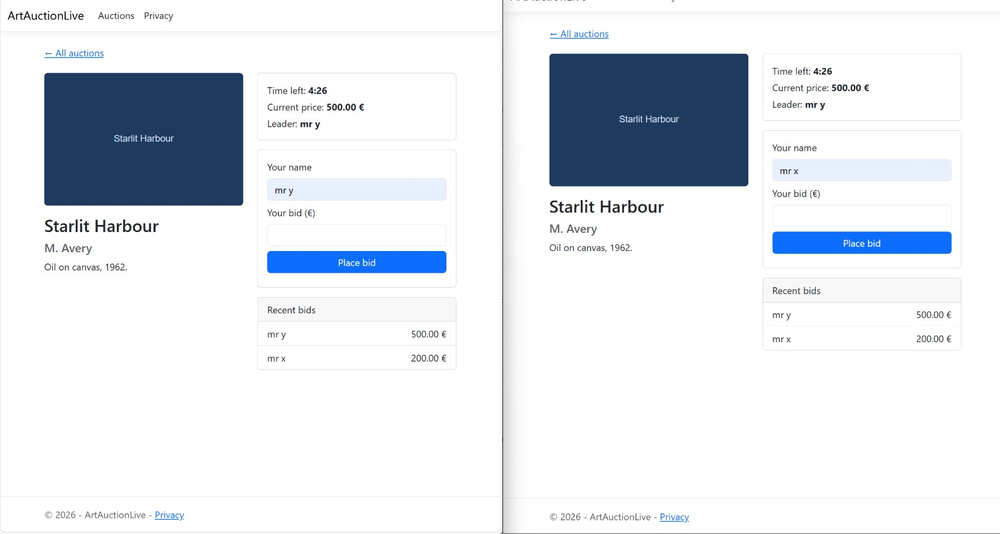

# ArtAuctionLive

A real-time, multi-user art auction web app. Bids, prices, the current leader and a
server-driven countdown update instantly across every connected client over WebSockets —
no page refresh. Late bids trigger an automatic overtime extension, and bidding is
concurrency-safe under simultaneous load.

## Features

- **Live bidding** — bids broadcast to all viewers of an auction in real time via SignalR.
- **Server-side countdown** — a background service owns the clock; all clients see the same time.
- **Overtime / anti-snipe** — a bid in the final 30 seconds extends the deadline by 30 seconds.
- **Concurrency-safe** — per-auction locking serialises competing bids so the price can never go backwards.
- **Auto-finish** — auctions close automatically when their timer expires and lock in the winner.
- **Reconnect-resilient** — clients re-join their auction room automatically after a dropped connection.

## Tech stack

- ASP.NET Core MVC (.NET 10)
- SignalR (WebSockets) for real-time updates
- Entity Framework Core 10 + SQLite
- Bootstrap 5 (bundled with the MVC template)

## Screenshots

<!-- TODO: add screenshots of the auction list and a live room with two clients bidding -->


## Running locally

Requires the .NET 10 SDK.

```bash
git clone <your-repo-url>
cd ArtAuctionLive
dotnet run --project src/ArtAuctionLive
```

The database is created and seeded automatically on first run. Open the URL shown in the
console (e.g. `http://localhost:5199`) and go to **/Auctions**. To see the real-time sync,
open the same auction in two browser windows and bid in one.

## Design decisions

- **Two-class timer (state vs. loop).** An `AuctionTimer` singleton holds each auction's
  live deadline in memory; a separate `BackgroundService` owns the once-per-second loop that
  broadcasts ticks and finishes expired auctions. Splitting "what the state is" from "when the
  loop runs" keeps each piece single-purpose and testable.
- **Singleton background service + scoped DbContext.** The loop is a singleton but needs the
  scoped `DbContext`, which can't be injected directly. It injects `IServiceScopeFactory` and
  creates a short-lived scope per database operation — the correct way to use scoped services
  from a singleton.
- **Concurrency.** Bids on the same auction are serialised with a per-auction `SemaphoreSlim`
  (async-compatible, unlike `lock`, because the critical section awaits a DB save). The auction
  is re-read inside the lock so a second simultaneous bidder sees the just-updated price. This
  is correct for a single instance; a multi-instance deployment would move to database-level
  optimistic concurrency.
- **DTOs over the wire.** Clients receive small purpose-built SignalR messages, never EF
  entities, so the database shape isn't leaked to the browser.
- **View models, not entities, in views.** Controllers project to read-only view models so the
  presentation layer is decoupled from the data model.
- **Deterministic SQLite path.** The database file is anchored to `ContentRootPath` so every
  launch method (`dotnet run`, the IDE, `dotnet ef`) resolves to the same file.

## What I learned

- Using scoped services safely from a singleton background service via `IServiceScopeFactory`.
- Async-safe locking with `SemaphoreSlim` and why `lock` can't wrap `await`.
- Driving real-time UI from the server with SignalR groups, and pushing to clients from outside
  a hub with `IHubContext`.
- Why relative SQLite paths break across launch contexts, and anchoring to the content root.

## Project structure

## Future work

- **Authentication** — bidders currently identify by a typed name; production would
  authenticate users and bid under the verified identity rather than a client-supplied string.
- **Image upload** — auctions take an image URL; a file-upload option with storage and
  content-type/size validation would be the next step (kept as a URL field for now to avoid
  rushing the file-handling security surface).
- **Bid history pagination** — the room shows the last 10 bids; older history could be paged.
- **Live deployment** — host a public demo (would move from SQLite to a hosted database).
- **Tests** — unit tests around BidService (concurrency, validation rules) and the timer.
